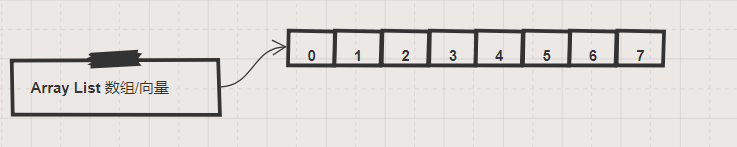

#### 从数组到向量
&nbsp;&nbsp;&nbsp;&nbsp;**数组**可以想象成酒店里面的房间, 每个客房依次都有一个唯一编号. 如果你想去某个房间, 只需要找到对应的门牌号就可以.

但是数组有个很明显的限制, 就是说它的容量是固定的, 有限的. 比如在运营某个酒店的时候, 房间数量是固定的, 极端情况下即便没有客人, 还是需要维护所有的房间. 而如果某天客人大于房间数量了, 房间数量也不能增加. 后来的客人只是选择其它酒店了.
&nbsp;&nbsp;&nbsp;&nbsp;不过, 计算机世界是一个虚拟的世界. 于是发明了**向量**这种数据结构. 它是对数组的封装和增强. 主要特征是: 它的容量能够根据需要, 动态的增加或者减少. 想象一下, 一个可以根据客人数量, 动态增加或者减少房间数量的酒店, 多么的合理. 所以, 我们只需要学习**向量**就可以了.

#### 具体实现
~~~
// 用Java实现的向量结构
public class XVector<E extends Comparable> {
  private static final int DEFAULT_CAPACITY = 3;
  private int _size;
  private int _capacity;
  private E[] _elem;
  
  // 一个最通用的构造方法
  @SuppressWarnings({"unchecked"})
  public XVector(Class<?> clazz, int capacity) {
    _size = 0;
    _capacity = capacity;
    _elem = (E[]) (Array.newInstance(clazz, capacity));
  }
  // ... 省略了很多其他的方法, 但是主要特征的代码会在下文中提到 ... 
}
~~~

#### 扩容和收缩

#### 遍历和查找

#### 排序

#### 阅读 ArrayList\<E\> 的源码